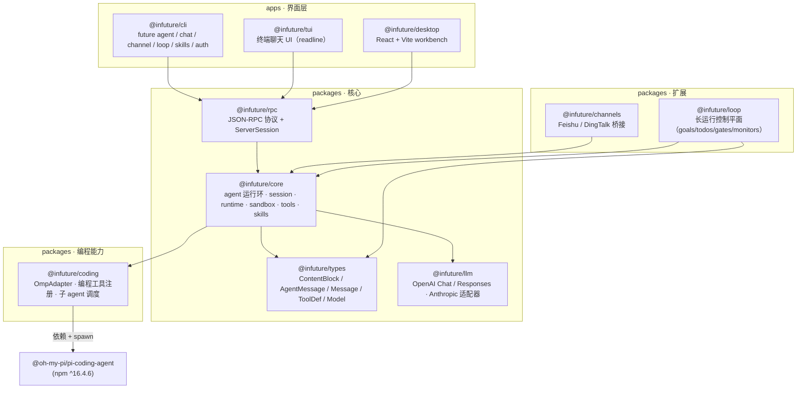
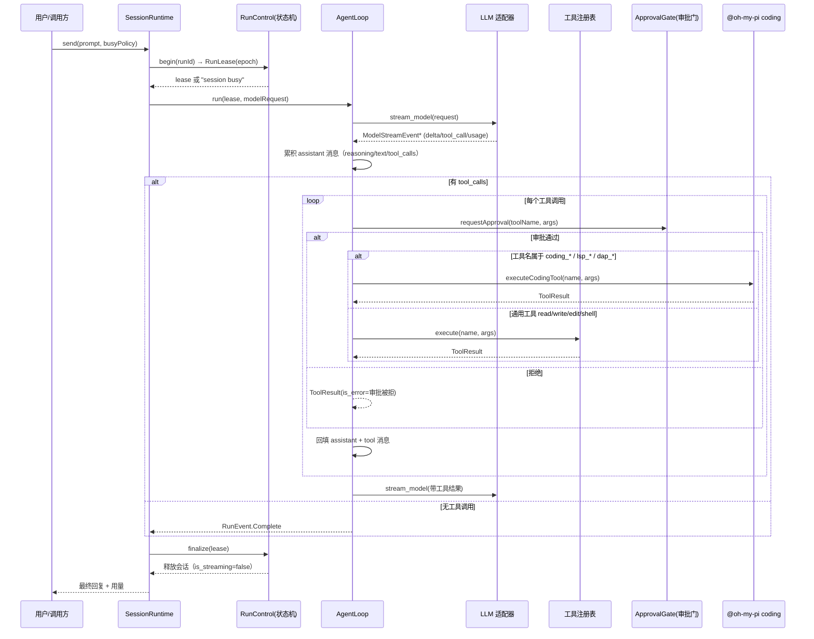
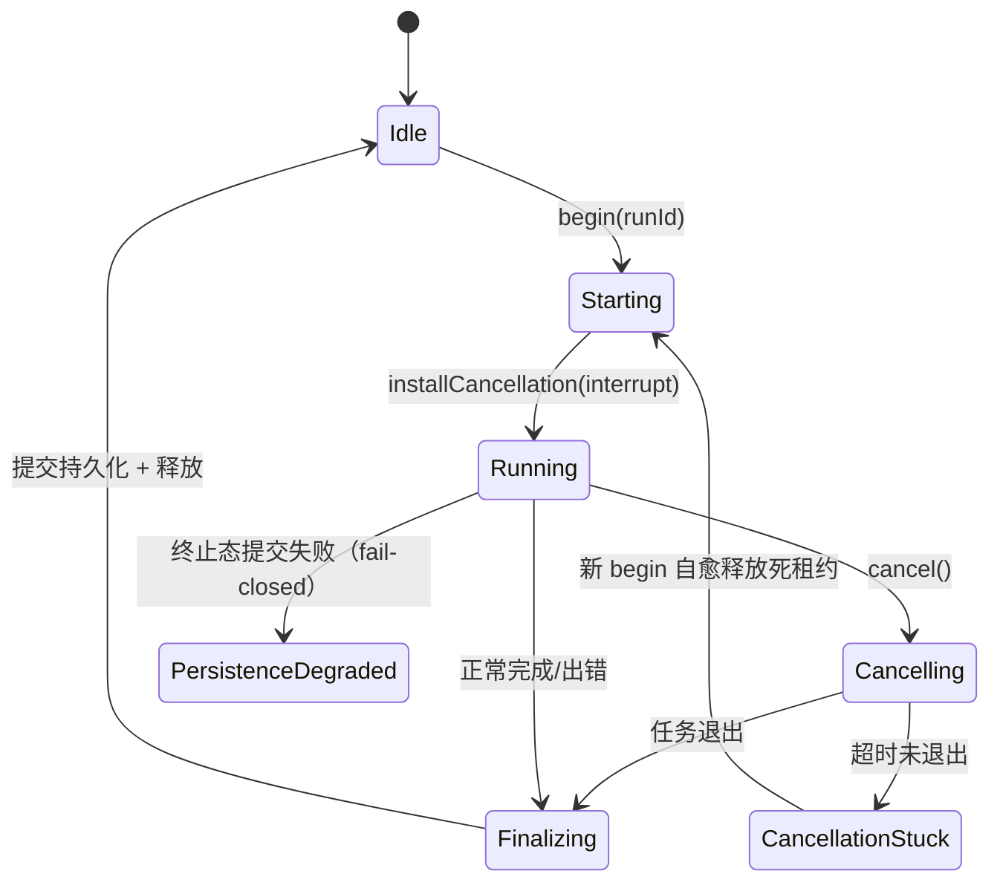
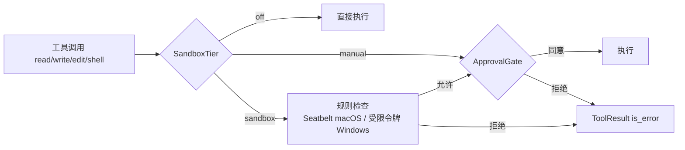
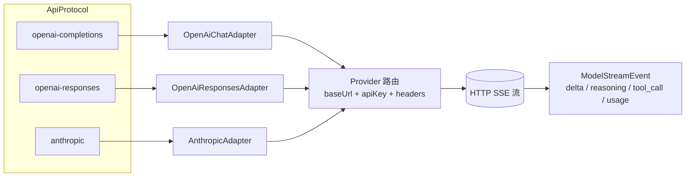
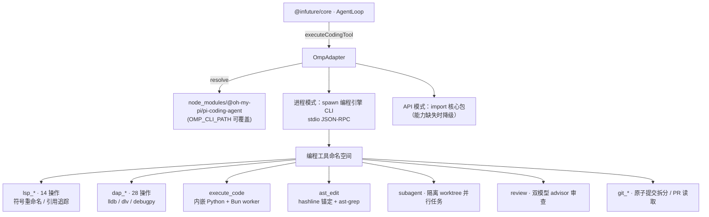
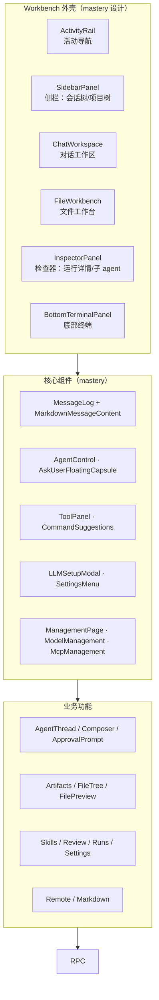
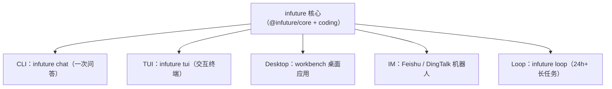

# infuture 架构图（graph）

本文是 infuture 的权威架构设计。所有图为 Mermaid 语法，可在任意 Mermaid 渲染器（VS Code 插件、mermaid.live、GitHub）中直接查看。

---

## 1. 模块依赖图（Monorepo）

**依赖方向**：界面层只依赖 `rpc`，`rpc` 只依赖 `core`，`core` 依赖 `types` / `llm` / `coding`。`coding` 是唯一接触第三方 `@oh-my-pi/*` 的包——其余包对编程能力无感知。

---

## 2. Agent 运行环（Run Loop）数据流

移植自原版 Rust agent 的 `run_loop.rs`（4279 行）。核心不变式：**每轮 = 模型流式输出 → 若有工具调用 → 审批门 → 执行 → 回填 → 再请求**。

**运行环关键配置**（`AgentConfig` 的 TS 对应）：

| 配置 | 说明 |
|---|---|
| `maxTurns` | 最大工具轮数（默认 10） |
| `thinkingBudget` | 思考预算（reasoning tokens） |
| `maxRetries` | 单次请求最大重试 |
| `beforeToolCall` / `afterToolCall` | 钩子：拦截/改写/后处理工具调用 |
| `toolsExecutionMode` | `parallel` / `sequential` |

---

## 3. 会话生命周期状态机

移植自 `agent/src/runtime/run_state.rs` 的 `RunControl`。

要点：
- **busy 策略**：`enqueue_if_busy`（追加排队）/ `supersede_session`（打断当前 run）。
- **幂等**：同 `clientRequestId` 拒绝重复接受；`CancellationStuck` 的租约在下次 `begin` 时自愈释放。
- **阶段语义**：`is_streaming` 仅作旧客户端兼容投影，权威状态是此状态机。

---

## 4. 沙箱与审批门（Trust-First）

移植自 `agent/src/sandbox/mod.rs`（1624 行）+ `windows.rs`（Seatbelt/受限令牌）。

TS 侧的沙箱层实现：
- `SandboxTier`：`off` / `manual` / `sandbox`，会话级可切换。
- `ApprovalGate`：工具执行前回调，桌面端弹出审批 UI、CLI 端进入 `/approve` 状态。
- 平台规则：macOS 用 `sandbox-exec`(seatbelt) 策略模板；Windows 用受限令牌（本实现先做策略描述层与回调层，平台降级为 `manual` 并记录）。

---

## 5. LLM 适配器图

移植自 `agent/src/llm/adapters/*`（openai_chat 1003 行 / openai_responses / anthropic）。

- `ModelRequest { model, systemPrompt, messages, tools }`，`stream_model` 返回异步事件流。
- `ProviderMetadata`：不透明命名空间协议状态（`openai` / `anthropic`），未知命名空间原样保留，保证多轮往返无损。
- 思考预算 `updateThinking(level, budget)` 运行时热更新。

---

## 6. 编程能力接入图

`@infuture/coding` 是 infuture 与 `@oh-my-pi/pi-coding-agent` 之间的唯一桥梁，模式取自 mastery 的 `omp-adapter.js`（spawn CLI）并扩展为**进程内 API 适配**。

能力合并清单（`docs/integration.md` 有完整表）：

| 维度 | 通用 agent 提供 | 编程 agent 提供 |
|---|---|---|
| 核心定位 | 通用 AI 操作系统/平台 | 终端编程专用 agent |
| LSP | — | 14 个 LSP 操作 |
| 调试器 | — | 28 个 DAP 操作 |
| 代码执行 | 仅 shell | 内嵌 Python + Bun worker |
| AST 编辑 | 文本级 edit | hashline 锚定 + ast-grep 结构化重写 |
| 子 agent | — | 一等子 agent，并行分发到隔离 worktree |
| 代码审查 | — | 双模型审查（advisor） |
| Git | — | 原子提交拆分、冲突解决、PR 读取 |
| 浏览器 | 有 | 有（更完善，支持 Electron 应用） |
| 文件操作 | read/write/edit/shell | 31 个内置工具（更丰富） |

---

## 7. 前端（desktop）组件图

设计语言来自参考 workbench，业务逻辑在 `apps/desktop/src`。

布局规则（量化）：侧栏 280px、ActivityRail 56px、InspectorPanel 320px、底部终端 220px；主区为 ChatWorkspace/FileWorkbench 切换；主题采用 mastery 的暗色 + 强调色 token。

---

## 8. 部署/表面（Surfaces）总览

所有表面共享同一 session / memory / skills / 审批门——一处批准，处处生效。
